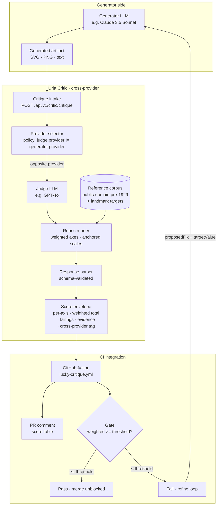
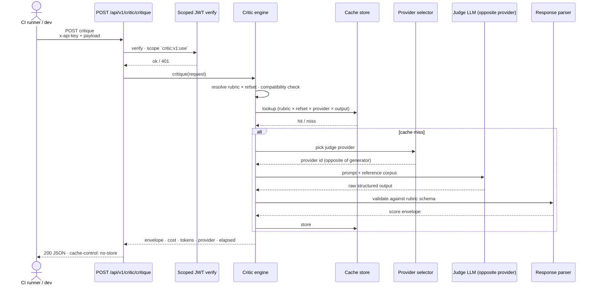

# 02 · Architecture

## System overview



The dotted line that doesn't exist on the diagram: there is no path where the generator's LLM provider feeds the judge's LLM provider. The provider selector enforces non-identity. The check happens before any tokens are spent.

## What each box does

| Box | Responsibility | Why it's its own concern |
|---|---|---|
| **Generator LLM** | Produce the artifact under review | Outside the Critic's repo. The Critic does not generate. |
| **Critique intake** | Validate request shape · resolve rubric × reference set compatibility · enforce `:use` scope on the JWT | HTTP concern. Does no LLM I/O. |
| **Provider selector** | Pick the judge provider given the generator's recorded provider · refuse if they match | Policy layer. One file. One rule. Cannot be bypassed by config. |
| **Judge LLM** | Produce a structured response against the rubric prompt | Adapter pattern · OpenAI today · Anthropic adapter is a sibling file behind the same interface. |
| **Rubric runner** | Build the prompt from rubric data · inject reference corpus · pass to provider | Pure function over (rubric, refset, output, providerInput). No I/O of its own. |
| **Reference corpus** | Versioned set of authoritative inputs · text + landmark targets + (where owned) image plates · public-domain pre-1929 line | Data, not code. Reference set version is part of the cache key. |
| **Response parser** | Validate the provider's structured output against the rubric's output schema · clamp scores · check severity tags | The provider can hallucinate fields; the parser is the seatbelt. |
| **Score envelope** | The wire shape returned to the caller · per-axis scores · weighted total · failings (severity 1–5) · narrative · cross-provider tag (`generated_by` vs `produced_by`) | This is the contract the CI integration consumes. |

## The single most load-bearing rule

**Engine has no HTTP. Provider has no rubric logic. Rubric has no I/O.** Every file is on exactly one side of those lines. That separation is what lets the provider adapter be swappable in a single PR — adding Claude as a judge today is a sibling file in `providers/`, not a refactor.

This is the same architectural rule the [Kriya astronomy API](https://github.com/Insights-By-Omkar/insights-astrology-api-case-study) ships under (engine has no HTTP, API has no astronomy). It's the rule I keep coming back to: **boundary discipline beats abstraction discipline** in solo-built systems.

## Request lifecycle

A critique request touches six phases:



Total: cache miss costs one round-trip to the judge provider plus parser overhead. Cache hit is single-digit-ms.

## Cache key composition

The cache key is the full tuple that determines the response:

```
critic_api_version · rubric_id · rubric_version · reference_set_id · reference_set_version · provider_id · output_hash · subject_hint?
```

Bumping any one of those — a rubric weight tweak, a reference-set image addition, a provider swap — invalidates the cached score. This matters because customers need to know when scores may shift on the same input. The cache is honest about which inputs determine the result; the provider tag in the envelope is the audit pointer.

## Reference corpus shape

A reference set is data, not prose. The shape:

| Field | Purpose |
|---|---|
| `id` · `version` | Stable identifier · SemVer per set |
| `subjectKind` | What kind of artifact this set evaluates (`character-figure`, `glyph`, `ornament`, etc.) |
| `compatibleRubrics` | Which rubric ids this set is valid against · the engine refuses incompatible pairings |
| `references[]` | Each entry: `kind` (`text` / `landmark` / `image`) · public-domain provenance · landmark numerical targets where applicable |
| `licenseProvenance` | One of: `public-domain`, `commissioned-owned`, `fair-use-critique`, `internal-curator-directive` · audit field |

A reference set update (adding image plates, tweaking a landmark target) is a minor SemVer bump. Removing or relabeling a landmark is a major bump. Existing cached scores invalidate on any bump.

## Rubric shape

Rubrics ship as data, not prompts. Each rubric is:

| Field | Purpose |
|---|---|
| `id` · `version` · `stability` | Stable identifier · SemVer · `experimental` / `beta` / `stable` |
| `subjectKinds[]` | Compatible reference-set subject kinds |
| `axes[]` | Each axis: `id`, `name`, `weight` (0..1, sum to 1), 4 calibration anchors at scores 2 / 5 / 8 / 10, `guidance` |
| `promptFraming` | Prose framing the judge sees · sets evaluator role · "be harsh, use anchors, don't praise without justification" |
| `globalGuidance` | Cross-axis rules · tie-breaks · named failure modes |

The judge is told: *"use the anchor descriptions as floor posts when choosing a score. Describe why the output falls between or on an anchor."* Scores 0, 1, 3, 4, 6, 7, 9 are reserved for the judge to use *between* anchors. That single calibration trick produces visibly more consistent scores than open-scale grading. See [04 · Rubric design](./04-decision-rubric-design.md).

## What's not in the architecture (intentionally)

- **No human review escalation queue inside the Critic.** Failings tagged `autoApplicable: false` surface to the caller; routing is the caller's concern. The Critic is a judge, not a workflow engine.
- **No retry-with-different-provider on disagreement.** A second provider's score for the same artifact is a *different* run with its own envelope. The audit trail demands provider attribution per run, not aggregation.
- **No SVG rasterization.** The Critic accepts `image-url` or `image-data` (data URI). SVG-to-raster is the caller's responsibility — there's no Chromium in a Vercel edge runtime, and shipping a rasterizer would push the function over the size cap. Callers rasterize via headless Playwright before posting.
- **No streaming.** The judge's response is structured; streaming partials would mean partial scores, which would mean a parser that handles partials. Not worth the complexity at v1.
- **No third-party eval-orchestrator integration shipped with v1.** LangSmith / Braintrust integration is on the roadmap as adapters, not baked-in primitives. See [06 · Build vs buy](./06-build-vs-buy.md).

## External surfaces

| Surface | What | Why |
|---|---|---|
| `GET /api/v1/critic/rubrics` | List rubrics (id, version, axisCount, stability) | Inspection · `:read` scope |
| `GET /api/v1/critic/rubrics/:id` | Full rubric definition | Inspection · `:read` |
| `GET /api/v1/critic/references` | List reference sets | Inspection · `:read` |
| `GET /api/v1/critic/references/:id` | One reference set's full definition | Inspection · `:read` |
| `POST /api/v1/critic/critique` | Run a critique · billable | The product · `:use` |

`:read` is free. `:use` is metered. Per-key rate-limited via Upstash with in-memory fallback. The same auth + rate-limit pattern is used across every Insights by Omkar API surface.

## Why this shape generalizes

The Critic was built for Urja's Visual API specifically — illustrations, glyphs, character renders. But the architecture has nothing visual about it. Strip the reference-corpus content out and replace it with code-review references, prose-style references, agent-trajectory references, and the same engine grades those domains.

Where the architecture is *visual-specific*: the rubric runner expects rasterized image input on the wire. Where the architecture is *general*: every other component (provider selector, rubric grammar, anchored scales, severity-tagged failings, cache-key composition, CI integration) reads as a generic eval gate.

That's why the case study is positioned at the AI-platform-PM lane, not the visual-API lane. The visual API is the surface; the eval policy is the artifact.

## Related decisions

- **[Cross-provider by design](./03-decision-cross-provider-by-design.md)** — why the provider selector exists and why it's not configurable
- **[Rubric design](./04-decision-rubric-design.md)** — the anchor-band trick, the parser contract, the calibration suite
- **[Public-domain corpus](./05-decision-public-domain-corpus.md)** — what's in the reference corpus and what's explicitly excluded
- **[CI integration](./07-ci-integration.md)** — how the score envelope becomes a PR comment and a release gate

---

**Next:** [03 · Decision · cross-provider by design](./03-decision-cross-provider-by-design.md)
