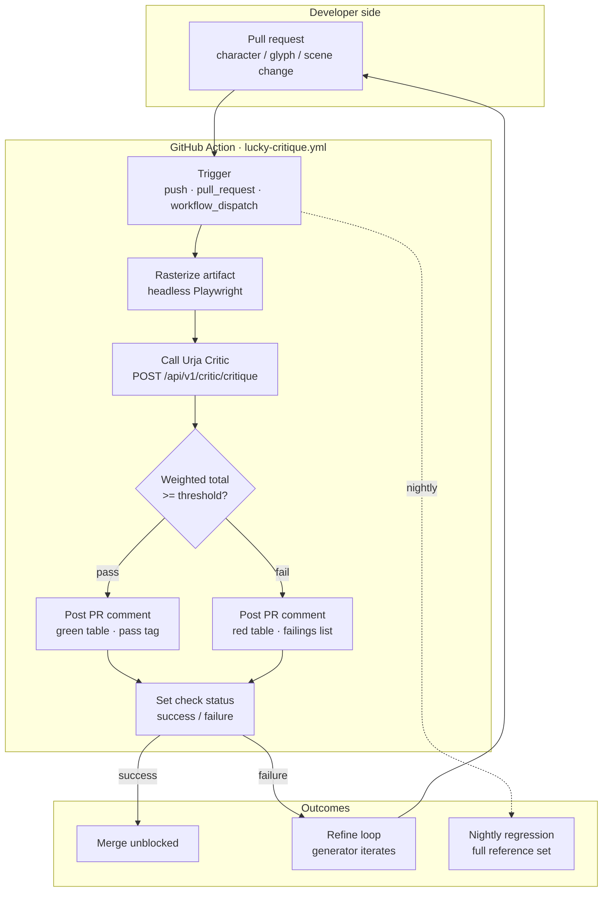
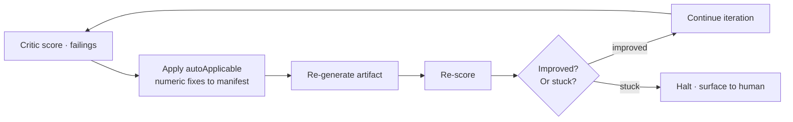

# 07 · CI Integration

## The bet

A Critic that returns a score envelope is worthless if no one looks at it. The bet for v1 is that **the Critic earns its keep through GitHub Actions, not through a dashboard**. Every score lands as a PR comment within seconds of the run finishing. Every gate decision is visible in the PR's checks list. Every failure points at the specific failing the developer has to fix.

This is the developer-experience side of the eval surface. The cross-provider policy and the rubric grammar matter because the developer reads the score table on a PR and trusts it.

## The integration shape



Three trigger paths:

| Trigger | When | Purpose |
|---|---|---|
| `push` to main | Every merge | Audit baseline · regression detection |
| `pull_request` | Every PR | Gate · pass/fail before merge |
| `workflow_dispatch` | Manual | Re-run after a flaky judge response |
| `schedule` (nightly) | 03:00 UTC | Regression sweep across the full reference set |

The PR-gate path is the one the developer interacts with daily. The nightly sweep is the long-term audit trail.

## What the PR comment looks like

Illustrative shape (the actual layout has been refined across several iterations of the consumer SaaS's release cadence):

```
URJA CRITIC · score table · pass

generated by anthropic/claude-3.5-sonnet · graded by openai/gpt-4o
rubric: character-figure v1.2.0 · reference: great-dane v1.1.0

Axis                          Score   Weight   Anchor band
silhouette-read-at-24px         8.5    0.25       8 → 10
proportion-fidelity             7.5    0.20       5 → 8
anatomy-coherence               8.0    0.20       8
stylistic-coherence             7.0    0.15       5 → 8
craft-finish                    7.5    0.20       5 → 8

Weighted total: 7.7 / 10  ·  threshold: 7.0  ·  PASS

Failings (severity ordered):
  [3] tuck-up shallower than reference  (axis: anatomy-coherence,
      landmark: tuck_up_depth, proposed: increase tuck_up_depth from 0.18 to 0.24,
      auto-applicable: true)
  [2] mask boundary lacks contrast at the cheekline  (axis: craft-finish,
      proposed: increase mask_alpha at cheek line, auto-applicable: false)
  [2] front-leg muscle definition reads soft  (axis: anatomy-coherence,
      proposed: tighten flexor curvature, auto-applicable: false)

Cache: miss  ·  cost: $0.0142  ·  elapsed: 4.1s

Re-run: gh workflow run lucky-critique.yml -f ref=feature/lucky-tuckup-fix
```

What the developer sees:

1. **Provider attribution at the top.** "Generated by Claude. Graded by GPT." The cross-provider guarantee is visible, every comment, every PR.
2. **Per-axis scores with anchor bands.** Not just a number — a placement on the calibrated scale.
3. **Failings ordered by severity, with `proposedFix` and `proposedTargetValue`.** The developer knows what to change.
4. **Cache state, cost, elapsed.** Engineering-honest about what the run cost.
5. **Re-run command.** No need to click around the GitHub UI.

If the gate fails, the comment is the same shape but the verdict line says `FAIL` and the PR check turns red. The conversation is the failings list.

## Pass/fail gate semantics

The gate is configurable per workflow but defaults to:

| Condition | Result |
|---|---|
| Weighted total ≥ rubric's documented threshold (7.0 default) | **Pass** |
| Weighted total < threshold | **Fail** |
| Any axis < axis floor (default 5.0) | **Fail** — no single-axis collapse |
| Any failing with `severity: 5` | **Fail** — breed-breaking failures override the weighted total |
| Provider call timeout / 5xx | **Fail open into manual review** — workflow tags PR for human triage |

The "fail open into manual review" path matters. A judge outage at 3 AM should not be a deploy outage at 3 AM. The fail-open path is loud (PR is tagged `critic-manual-review`) but unblocked.

## Sample-rate vs gate-rate split

Cross-provider grading is ~2× the per-call cost of single-provider. The CI integration handles this with two concentric loops:

- **Inner loop · refinement.** When the developer is iterating on a single artifact, the workflow runs against a *cached baseline* score from the last cross-provider pass. Iteration is fast and cheap.
- **Outer loop · gate.** Every PR merge runs a fresh cross-provider critique. This is the gate. ~2× cost is acceptable insurance.
- **Nightly sweep.** A bounded sample (e.g. 10% of the artifact catalog rotated nightly) re-runs cross-provider against the current rubric and reference-set versions. Catches calibration drift over time.

The split is the practical answer to *"isn't cross-provider grading expensive?"* — yes, at the gate, not at every keystroke.

## Why PR comments and not a dashboard

A v1 dashboard was scoped and cut. Reasoning:

- **Dashboards demand traffic to stay useful.** A score history dashboard with 4 visits a week is a maintenance liability, not a tool.
- **PR comments demand zero new traffic.** Developers already read PR comments. Inserting the score table where developers already look is more useful than building a new place to look.
- **The score envelope is JSON.** Anyone who wants a dashboard can build one over the API. The data is on the wire.

A dashboard ships eventually. v1 ships PR comments. The order is intentional — get the eval gate trusted in CI first, then add visualizations.

## Auto-refine — the loop the rubric grammar enables

The rubric's `proposedTargetValue` field is what makes auto-refine viable. When a failing has `autoApplicable: true` and a numeric target, the refinement loop is:



The auto-refine loop runs only against `autoApplicable: true` failings. Structural failings (`autoApplicable: false`) surface to the human review queue — they're the "add a visible stop in the skull silhouette" class of fix that no parameter tweak resolves.

The halt condition is two-stage: (a) score plateau across N iterations (no improvement), or (b) a regression below the previous iteration's score (the change made things worse). Either condition surfaces the artifact to the human review queue with the iteration history attached.

## What the workflow file looks like (illustrative)

The actual workflow file is private; the shape is straightforward and is the kind of YAML any team can adapt:

```yaml
name: lucky-critique
on:
  pull_request:
    paths:
      - "data/characters/**"
      - "lib/render/**"
  schedule:
    - cron: "0 3 * * *"  # nightly regression
  workflow_dispatch:
    inputs:
      refset:
        description: "Reference set id"
        required: false
        default: "great-dane"

jobs:
  critique:
    runs-on: ubuntu-latest
    steps:
      - uses: actions/checkout@v4
      - uses: actions/setup-node@v4
        with: { node-version: 20 }
      - run: npm ci
      - name: Rasterize artifact
        run: npm run render:lucky -- --out artifact.png
      - name: Run critic
        env:
          CRITIC_API_KEY: ${{ secrets.CRITIC_API_KEY }}
        run: npm run critique -- --rubric character-figure --refset ${{ inputs.refset || 'great-dane' }} --input artifact.png --out critique.json
      - name: Post PR comment
        if: github.event_name == 'pull_request'
        uses: actions/github-script@v7
        with:
          script: |
            const r = require('./critique.json');
            // ... renders the score table, posts via octokit
      - name: Gate
        run: node scripts/critic/gate.mjs critique.json
```

The shape is unsurprising. The value is in *what it surfaces* — provider attribution, per-axis scores, severity-tagged failings, anchor bands — not in the YAML.

## What the developer learns over time

After running the gate against ~50 artifacts, the developer learns:

- **Which axes the rubric is strict on.** Severity-tagged failings cluster on certain axes; the developer adjusts the generator's defaults.
- **Which failings the auto-refine loop fixes vs which need human attention.** The `autoApplicable` flag becomes the developer's mental triage filter.
- **What the cross-provider scores look like vs what intuition expected.** Calibration improves on both sides — the developer's intuition tunes to the rubric, and over time the rubric's anchors refine to what survives review.

The Critic is, fundamentally, a teaching tool wrapped in a gate. Every PR comment teaches the developer something specific about the rubric. The teaching compounds across the codebase.

## What's not in the CI integration (yet)

- **Slack notifications** for failed gates. Roadmap. Today the GitHub PR notification is the channel.
- **Score-history charts** in the PR comment. The score envelope has the data; the rendering is on the dashboard roadmap.
- **First-party LangSmith / Braintrust adapters.** The Critic's HTTP API works with any orchestrator; first-party adapters are roadmap based on customer demand.
- **Custom thresholds per file path.** Today the threshold is per-rubric. Per-path thresholds (e.g. higher bar for hero images, lower bar for utility glyphs) are a natural v2 addition.

## What this evidences

For the Senior PM · AI Platforms lane, the CI integration evidences:

- **Developer-experience-first design.** The eval gate is meaningless without the PR comment; the case study treats the comment as the product.
- **Cost-aware loop design.** Inner-loop iteration uses cached baselines; outer-loop gates pay the cross-provider premium. This is the kind of cost discipline platform teams ship.
- **Fail-open vs fail-closed judgment.** A judge outage shouldn't block deploys; the manual-review escalation is intentional, not accidental.
- **Bounded scope at v1.** Slack, dashboards, custom thresholds — all roadmap, all explicitly out of v1. v1 ships the gate that earns the rest of the surface.

---

**Next:** [08 · Outcomes & lessons](./08-outcomes-and-lessons.md)
